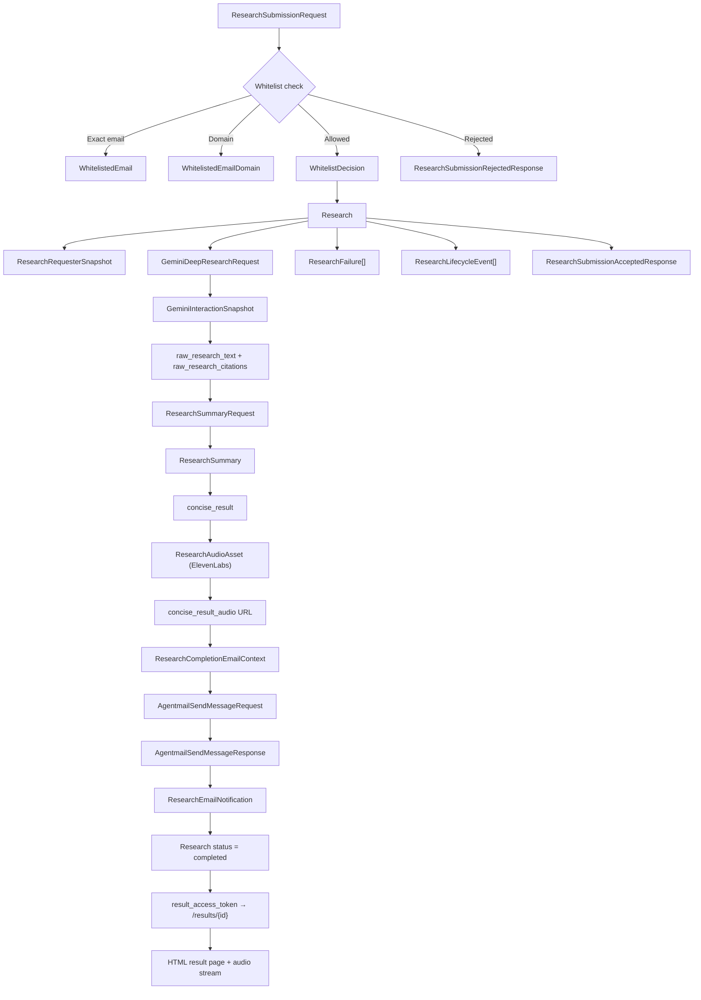

# Signals Models in Workflow

This document explains how the Pydantic models in [`models.py`](./models.py) are used across the Signals service workflow, which models are persisted, which models are transient, and how the models connect to each other.

The design follows the constraints from [`prd.md`](./prd.md) and [`AGENTS.md`](./AGENTS.md):

- Pydantic v2 models
- UUID business identifiers
- UTC timestamps
- single-query MongoDB reads where possible
- one consolidated model file

## 1. Model Layers

Signals has three model layers.

| Layer | Purpose | Main Models |
| --- | --- | --- |
| Runtime configuration | Load environment-driven service configuration | `SignalsSettings` |
| Persisted MongoDB documents | Store business state durably | `WhitelistedEmail`, `WhitelistedEmailDomain`, `Research` |
| Embedded and transient workflow models | Structure nested state, request payloads, integration payloads, and provider snapshots | `ResearchRequesterSnapshot`, `WhitelistDecision`, `GeminiInteractionSnapshot`, `ResearchSummary`, `ResearchAudioAsset`, `ResearchEmailNotification`, `ResearchSubmissionRequest`, `AgentmailSendMessageRequest`, and related helper models |

## 2. Authoritative MongoDB Documents

Only three top-level models map directly to MongoDB collections.

| Collection | Model | Role in system |
| --- | --- | --- |
| `whitelisted_emails` | `WhitelistedEmail` | Explicitly approved individual email addresses |
| `whitelisted_email_domains` | `WhitelistedEmailDomain` | Approved corporate domains |
| `researches` | `Research` | Full end-to-end research workflow document |

Everything else is either:

- embedded inside `Research`
- used at API boundaries
- used at provider boundaries
- used as internal service payloads between steps

## 3. The `Research` Document Is the Workflow Anchor

`Research` is the home document for the whole Signals lifecycle.

It deliberately embeds the state needed for the main read path:

- who requested the research
- why they were allowed
- what was sent to Gemini
- the latest Gemini interaction state
- the raw research report and source citations
- the concise summary
- audio asset metadata and tokenized audio URL
- outbound email delivery state
- failures and lifecycle events
- `result_access_token` for secure result page access

This means the UI, admin tools, and background jobs can usually answer workflow questions with a single read from `researches`.

## 4. Workflow, Step by Step

## 4.1 SPA submission

The SPA sends:

- `topic`
- `email`

This payload is validated by `ResearchSubmissionRequest`.

Normalization happens immediately:

- email is lowercased and validated
- topic is trimmed and length-limited (max 2,000 characters)

If the submission is rejected, the API returns `ResearchSubmissionRejectedResponse` (HTTP 403).

If the submission is accepted, the API returns `ResearchSubmissionAcceptedResponse` (HTTP 202).

## 4.2 Whitelist validation

Whitelist validation reads two collections:

- `WhitelistedEmail`
- `WhitelistedEmailDomain`

The result of that check is converted into `WhitelistDecision`.

`WhitelistDecision` is then embedded into `Research` so the service preserves:

- whether access was allowed
- why access was allowed
- which collection matched
- which whitelist document matched
- what normalized value matched

This is important because authorization should remain auditable even if the whitelist changes later.

## 4.3 Research creation

When the request is allowed, the service creates a new `Research` document.

At creation time the important fields are:

- `research_id`
- `result_access_token` (opaque UUID for securing the result page)
- `topic`
- `requester: ResearchRequesterSnapshot`
- `whitelist_decision: WhitelistDecision`
- `gemini_request: GeminiDeepResearchRequest`
- `status = research_queued`
- `summary = ResearchSummary(...)`
- `audio_asset = ResearchAudioAsset(...)` (initialized to `pending`)
- `lifecycle_events`

`ResearchRequesterSnapshot` duplicates both:

- `email`
- `email_domain`

This keeps the requesting identity queryable without recomputing or rejoining.

## 4.4 Gemini submission

The service submits a Deep Research job using `GeminiDeepResearchRequest`.

This model is intentionally narrow and only describes the payload Signals actually depends on:

- `input` (structured prompt built by `prompting.build_deep_research_input`)
- `agent`
- `background=True`

After submission, the provider response is captured into `GeminiInteractionSnapshot`.

Important fields in `GeminiInteractionSnapshot`:

- `interaction_id`
- `status`
- `submitted_at`
- `last_polled_at`
- `next_poll_at`
- `poll_attempt_count`
- `usage`
- `error`
- `final_text_output`

This is a stable internal snapshot, not a full mirror of the Gemini SDK object.

## 4.5 Polling the background research

The background poller reads `Research` documents whose Gemini task is still active.

The poller uses these fields:

- `status`
- `gemini_interaction.status`
- `gemini_interaction.next_poll_at`
- `gemini_interaction.poll_interval_seconds`

When Gemini is still running:

- `gemini_interaction.status` is updated
- poll metadata is updated
- a `ResearchLifecycleEvent` is appended

When Gemini completes:

- `raw_research_text` is populated
- `raw_research_saved_at` is set
- `raw_research_citations` is populated from `GeminiTextOutput.annotations`
- `gemini_interaction.final_text_output` stores the final provider text block
- `status` transitions to `research_completed` and then immediately into the summarization step

When Gemini fails or is cancelled:

- `ResearchFailure` is appended
- `failed_at` or `cancelled_at` is set
- `status` becomes `research_failed` or `cancelled`

## 4.6 Summarization

Summarization is driven from persisted research state.

The service prepares a `ResearchSummaryRequest` using:

- `research_id`
- `topic`
- `raw_research_text`
- `prompt_reference`

The summarization metadata lives in `ResearchSummary`.

`ResearchSummary` tracks:

- current stage status
- provider/model choice
- prompt identity (including SHA-256 hash for reproducibility)
- input and output character counts
- timestamps
- failure details if summarization fails

The actual user-facing summary text is stored at the top level in:

- `Research.concise_result`

This duplication is intentional.

`concise_result` is the business field the rest of the application cares about.
`summary` stores the process metadata around how that field was produced.

## 4.7 Audio Generation (ElevenLabs)

Audio generation starts immediately after successful summarization.

The service synthesizes `Research.concise_result` into speech using the ElevenLabs Text-to-Speech API.

`ResearchAudioAsset` tracks the full lifecycle of this step:

- `status` (pending → in_progress → completed / failed)
- `provider` (always `elevenlabs`)
- `model_name`, `voice_id`, `output_format`
- `storage_provider` (always `local_filesystem`)
- `file_path` (absolute path to the saved MP3)
- `mime_type`, `byte_count`
- timestamps (started_at, completed_at, failed_at)
- `failure` (ResearchFailure if the step fails)

After the audio file is saved, the service:

1. Sets `Research.concise_result_audio` — a tokenized URL for streaming the file (e.g. `/results/{id}/audio?token=...`).
2. Sets `audio_asset.status = completed`.
3. Transitions `Research.status` to `ready_to_email`.

If audio generation fails, `Research.status` becomes `audio_failed`.

## 4.8 Email composition and sending

Once audio generation is complete, the service builds a `ResearchCompletionEmailContext`.

This context is what the email template layer needs:

- `research_id`
- `topic`
- `recipient_email`
- `result_url` (deep link to the result page, including `result_access_token`)
- `completed_at`

The outbound send payload is represented by `AgentmailSendMessageRequest`.

This model captures Agentmail constraints that matter to Signals:

- sender inbox
- recipient lists
- subject
- text body
- HTML body
- label set (`["signals", "research-ready"]`)
- 50-recipient limit across `to`, `cc`, and `bcc`

After a successful send, the service records `AgentmailSendMessageResponse` into `ResearchEmailNotification`.

`ResearchEmailNotification` stores:

- delivery status
- sender and recipient
- rendered email content
- provider message and thread IDs
- timestamps
- failure details if sending fails

At this point `Research.status` transitions to `completed`.

## 4.9 Result Page & Audio Streaming

The email sent to the user contains a secure deep link:

```
/results/{research_id}?token={result_access_token}
```

The `result_access_token` is an opaque UUID generated once when the `Research` document is created. It is never displayed in the SPA or API responses; it is only embedded in the emailed link.

Two HTTP endpoints serve the result:

- `GET /results/{research_id}?token=...` — renders an HTML page with the `concise_result` (markdown converted to HTML).
- `GET /results/{research_id}/audio?token=...` — streams the MP3 audio file from the local filesystem.

Both endpoints validate the token against `Research.result_access_token` and return 404 if it does not match.

## 4.10 Failures and audit trail

Two embedded models make the workflow operable in production.

`ResearchFailure` stores normalized failure records for:

- research (Gemini interaction)
- summarization
- audio generation
- email sending

`ResearchLifecycleEvent` stores append-only audit history for major transitions such as:

- request accepted
- whitelist validated
- Gemini submitted
- Gemini polled
- research completed
- summarization started / completed / failed
- audio generation started / completed / failed
- email started / sent / failed

The result is that a single `Research` document can answer both:

- "What is the current state?"
- "How did it get here?"

## 4.11 SPA Status Polling

The SPA can poll `GET /api/researches/{research_id}`, which is mapped to `ResearchStatusResponse`.

This response exposes:

- overall `status` (ResearchStatus enum)
- `gemini_status`, `summary_status`, `audio_status`, `notification_status`
- `concise_result_available` (bool)
- `concise_result_audio_available` (bool)
- key timestamps and `latest_failure_message`

This allows the SPA to show granular progress to the user without revealing any secure tokens.

## 5. Interconnection Graph



## 6. Embedded Models Inside `Research`

These models are not separate collections. They are embedded because they are read together with the parent `Research` document.

| Embedded model | Why it is embedded |
| --- | --- |
| `ResearchRequesterSnapshot` | The requester is always needed when viewing a research record |
| `WhitelistDecision` | The authorization outcome is part of the research audit trail |
| `GeminiInteractionSnapshot` | Polling and result inspection happen from the research record |
| `ResearchSummary` | Summary metadata belongs to the same workflow |
| `ResearchAudioAsset` | Audio generation metadata and status belong to the same workflow |
| `ResearchEmailNotification` | Delivery state is part of the same workflow |
| `ResearchFailure` | Failures should be visible without secondary queries |
| `ResearchLifecycleEvent` | Timeline and supportability benefit from single-document reads |
| `GeminiUrlCitation` / `GeminiFileCitation` / `GeminiPlaceCitation` | Citations belong to the stored research result |

## 7. Transient Models

These models usually do not get stored as standalone documents.

| Model | Role |
| --- | --- |
| `ResearchSubmissionRequest` | FastAPI input from SPA |
| `ResearchSubmissionAcceptedResponse` | FastAPI success response (HTTP 202) |
| `ResearchSubmissionRejectedResponse` | FastAPI rejection response (HTTP 403) |
| `ResearchStatusResponse` | FastAPI status polling response |
| `GeminiDeepResearchRequest` | Provider request payload persisted inside `Research` |
| `ResearchSummaryRequest` | Internal service payload for summarization |
| `ResearchCompletionEmailContext` | Template/rendering payload for the email layer |
| `AgentmailSendMessageRequest` | Provider request payload for Agentmail |
| `AgentmailSendMessageResponse` | Provider response payload from Agentmail |

## 8. Key Workflow Invariants Encoded in `models.py`

The models now encode several important business rules directly.

- A `Research` document cannot exist with `whitelist_decision.allowed = False`.
- `raw_research_saved_at` cannot exist unless `raw_research_text` exists.
- `concise_result` can only exist when `summary.status = completed`.
- `summary.status = completed` requires `concise_result`.
- `concise_result_audio` can only exist when `audio_asset.status = completed`.
- `audio_asset.status = completed` requires `concise_result_audio`.
- `status = research_completed` requires `raw_research_text`.
- `status = audio_generation_in_progress` requires `concise_result`.
- `status = ready_to_email`, `email_sending`, or `completed` requires `concise_result`.
- `status = completed` requires a `ResearchEmailNotification` whose status is `sent`.
- Terminal failed statuses require `failed_at`.
- `cancelled` requires `cancelled_at`.

These invariants matter because they prevent the workflow document from drifting into logically impossible states.

## 9. Why Some Data Is Intentionally Duplicated

The schema duplicates a few values on purpose.

| Value | Stored in multiple places | Why |
| --- | --- | --- |
| requester domain | `ResearchRequesterSnapshot.email_domain`, whitelist records | Fast matching and easy auditing |
| concise summary | `Research.concise_result` and `Research.summary` metadata | Business read path plus generation metadata |
| final provider output | `Research.raw_research_text` and `GeminiInteractionSnapshot.final_text_output` | Clean business field plus provider snapshot fidelity |
| timestamps | top-level workflow timestamps and stage-specific timestamps | Efficient workflow filtering plus detailed debugging |
| audio URL | `Research.concise_result_audio` and `ResearchAudioAsset.file_path` | Tokenized URL for streaming vs. raw filesystem path for serving |

This duplication is aligned with the MongoDB rule from `AGENTS.md`: optimize the common read path for one-query access.

## 10. Recommended Query Patterns

The schema suggests these high-value access patterns for the service layer.

| Query need | Main fields |
| --- | --- |
| Exact email whitelist check | `whitelisted_emails.email`, `whitelisted_emails.status` |
| Domain whitelist check | `whitelisted_email_domains.domain`, `whitelisted_email_domains.status` |
| Poll due research jobs | `researches.status`, `researches.gemini_interaction.next_poll_at`, `researches.gemini_interaction.status` |
| Find queued submissions | `researches.status = research_queued` |
| Fetch requester history | `researches.requester.email`, `researches.created_at` |
| Find failed workflows | `researches.status`, `researches.failed_at` |
| Find ready-to-email workflows | `researches.status = ready_to_email` |
| Validate result page token | `researches.research_id`, `researches.result_access_token` |

## 11. Practical Implementation Rule

When building the service, treat `Research` as the single workflow aggregate.

That means:

- create it once after whitelist approval
- update it as Gemini progresses
- append failures and lifecycle events instead of scattering state elsewhere
- keep `concise_result`, `audio_asset`, and email state inside the same document
- never expose `result_access_token` through the SPA status API; only embed it in emailed links

If a future feature adds admin dashboards, retries, or observability, those features should still be able to start from the `Research` document and only fall back to provider APIs when necessary.
